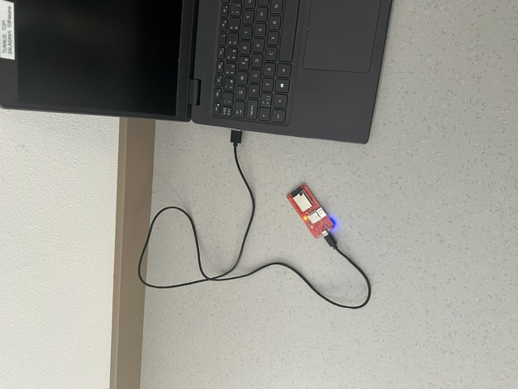
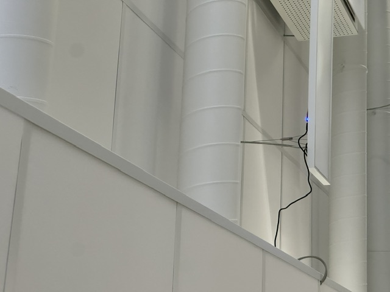
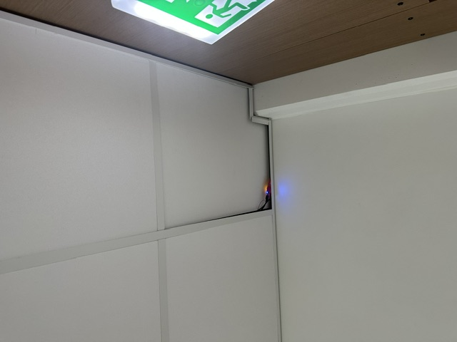
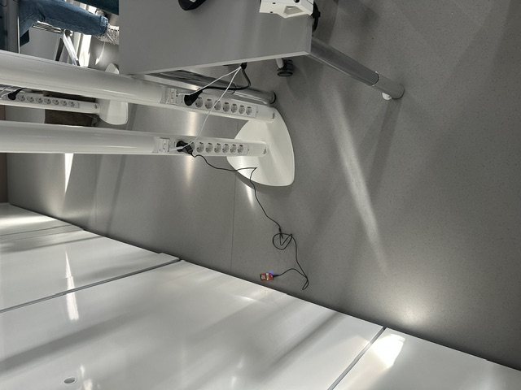
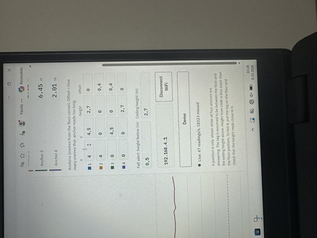
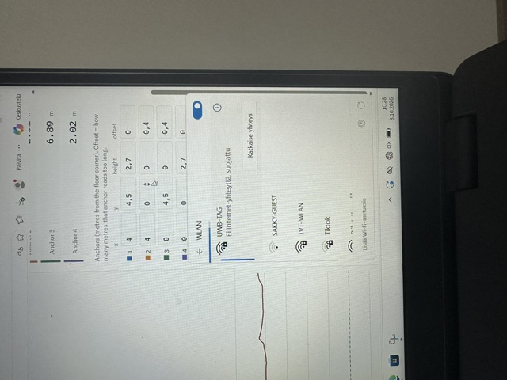
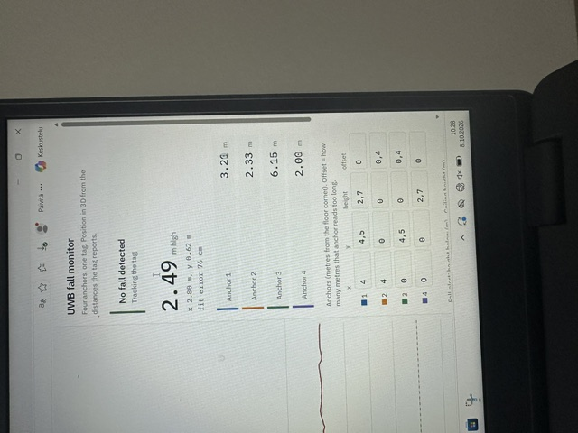
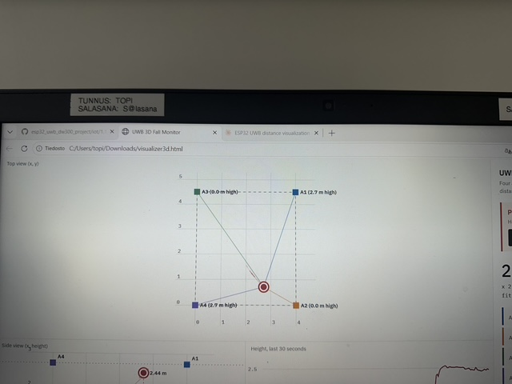
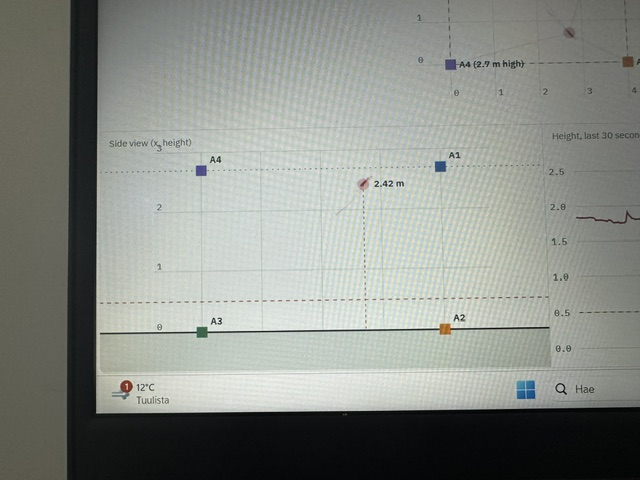
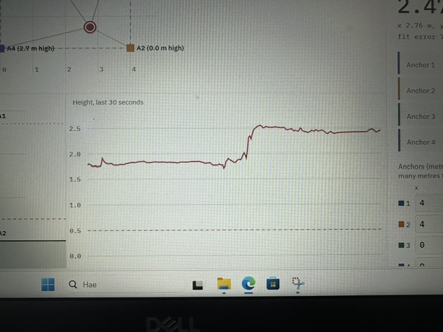

# UWB Fall Monitor: Visual Guide

A step-by-step look at setting up the system and reading the viewer.

## 1. Place the anchors

Place the four anchors around the room, **two high up and two low down** (near the floor), on opposite corners. The different heights are what allow the system to work out how high the tag is.

Tips:
- Point each antenna into the room, with no metal directly behind it.
- Keep a clear line of sight between the anchors and the tag.
- Measure each anchor's position carefully. You will need these numbers in the next step.

## 2. Enter the anchor positions in the viewer

Open `visualizer3d.html` and enter the position of each anchor in the table, in metres from one corner of the room's floor:

- **x** and **y**: where the anchor is on the floor plan
- **height**: how high the anchor's antenna is above the floor

## 3. Connect to the tag's Wi-Fi

Power on the tag and the anchors. On your computer, connect to the Wi-Fi network created by the tag, called **UWB-TAG** (password `uwb12345`).

## 4. Connect the viewer to the tag

In the viewer, click the **Connect WiFi** button. The status line changes to "Connected over Wi-Fi" and then shows the number of readings per second.

## 5. Reading the viewer

### Distances to each anchor

This panel shows the distance in metres from each anchor to the tag. All four numbers must be showing for the tag to appear on the map.

### Top view

The top-down view shows the anchors and the tag as it moves around them.

### Side view

The side view shows the tag's height between the anchors. Note that UWB is less accurate for height than for floor position, so this reading can be off by 20 to 50 cm.

### Height graph

The graph shows the tag's height over the last 30 seconds, in metres. A fast drop to a low height is what triggers the fall alert.

## Video: the tag in motion

Watch how the tag moves in the viewer as it is carried around the room:

[Watch the demo video](videos/demo.mov)

<!-- To play the video directly on GitHub, drag the file into the README editor on github.com.
     GitHub then inserts a link that plays inline. -->
